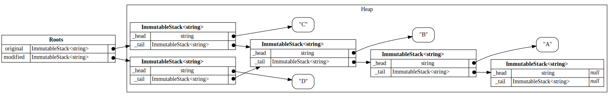

# MemoryView

A small library that helps visualize object graphs.

For example, the following code:

```csharp
using System.Collections.Immutable;
using MemoryView;

var original = ImmutableStack.Create(new[] { "A", "B", "C" });
var modified = original.Pop().Push("D");

var graph = Inspect.CreateGraph(original, modified);

graph.WriteDot(Console.Out);
```

produces a [Graphviz DOT graph](https://graphviz.org/doc/info/lang.html) which after `dot -Tsvg` generates the following image:

